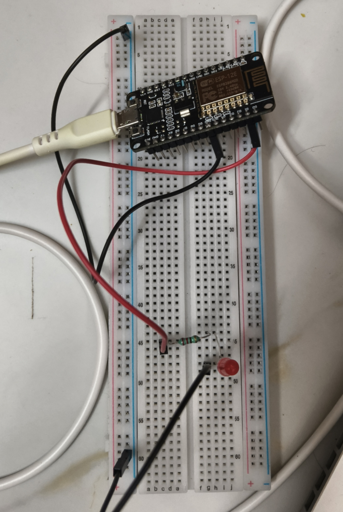
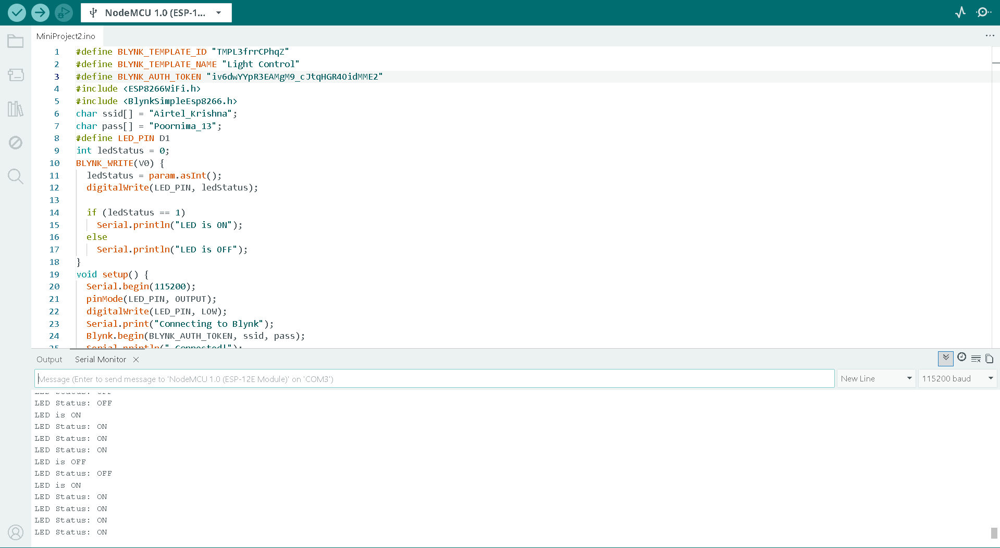
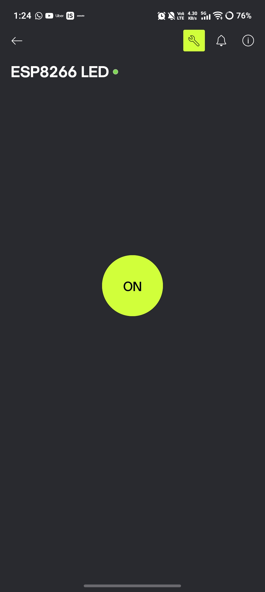
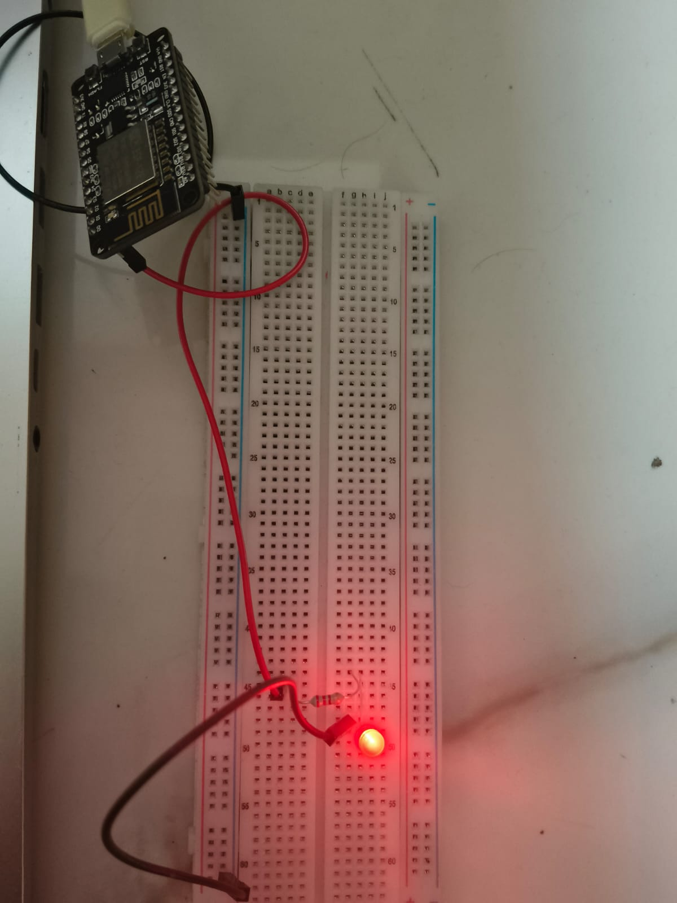
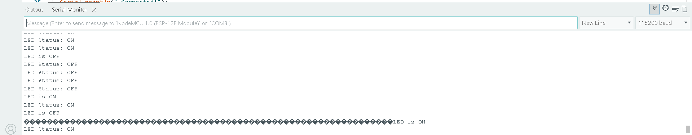

# IoT Light Control via Blynk Mobile App

## Project Overview
This project demonstrates wireless control of an LED using the Blynk IoT mobile app and ESP8266 NodeMCU. A button widget on the Blynk app controls the LED ON and OFF from anywhere in the world over the internet. This demonstrates bidirectional IoT control.

## Platform
- **Hardware:** ESP8266 NodeMCU + LED + 220Ω Resistor
- **App:** Blynk IoT
- **IDE:** Arduino IDE 2.x
- **Difficulty:** Medium
- **Type:** Mini Project 2 - Hardware Simulation

## Components Used
| Component | Quantity | Description |
|---|---|---|
| ESP8266 NodeMCU | 1 | Wi-Fi microcontroller |
| LED | 1 | Visual load indicator |
| 220Ω Resistor | 1 | Current limiting resistor |
| Jumper Wires | 3 | Connections |
| USB Cable | 1 | Power and programming |
| Android/iOS Phone | 1 | To run Blynk IoT app |

## Circuit Connections
| Component | ESP8266 Pin |
|---|---|
| LED long leg (+) via 220Ω resistor | D1 |
| LED short leg (-) | GND |

## Blynk Setup
1. Register at https://blynk.io
2. Create new Template
3. Add Datastream — Virtual Pin V0, Integer, Min 0, Max 1
4. Create Device from template
5. Copy Auth Token
6. Download Blynk IoT app
7. Add Button widget — assign to V0, mode Switch

## Libraries Required
- ESP8266WiFi
- BlynkSimpleEsp8266

## How to Run
1. Install Arduino IDE 2.x
2. Install Blynk library via Library Manager
3. Create Blynk account and template
4. Replace WiFi credentials and Auth Token in code
5. Upload code to ESP8266
6. Open Serial Monitor at 115200 baud
7. Open Blynk app and tap button to control LED

## Features
- Wireless LED control from anywhere
- Real-time ON/OFF status on Serial Monitor
- Bidirectional IoT communication
- Status updates every 5 seconds

## Output Screenshots
### Circuit Diagram

### Arduino IDE

### Blynk App

### LED Glowing

### Serial Monitor

## Author
**Poornima M R**
Final Year B.E. Electronics and Communication Engineering
GSSS Institute of Engineering and Technology for Women, Mysuru
VTU Affiliated | 2026 Batch

## Internship
**GlowLogics Solutions Pvt. Ltd.**
IoT Internship 2026
Mini Project 2 - Hardware Simulation
